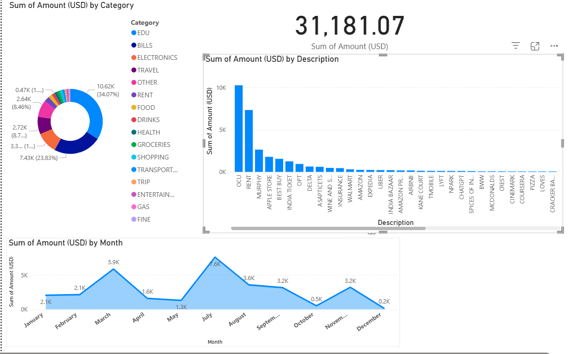

# 💳 Credit Card Usage Analysis

This project analyzes personal credit card spending data using Python and Power BI to uncover insights, patterns, and spending behavior.

## 📁 Project Structure

- `code.ipynb` – Python notebook for data cleaning and analysis
- `Credit_Card.csv` – Raw transaction data
- `Cleaned_Credit_Card_Data.xlsx` – Cleaned version of the data
- `Credit Card.pbix` – Power BI dashboard
- `image.png` – Dashboard screenshot preview

## 🛠 Tech Stack

- Python (Pandas, Matplotlib, NumPy)
- Power BI
- Excel

## 📊 Key Insights

- Identified monthly spending trends and high-expense categories
- Detected possible duplicate or erroneous transactions
- Visualized category-wise spending in Power BI

## 📸 Dashboard Preview

## 🚀 How to Run

1. Open `code.ipynb` in Jupyter Notebook
2. Load the `.csv` file and run through cleaning steps
3. Open `Credit Card.pbix` in Power BI Desktop to explore visuals

